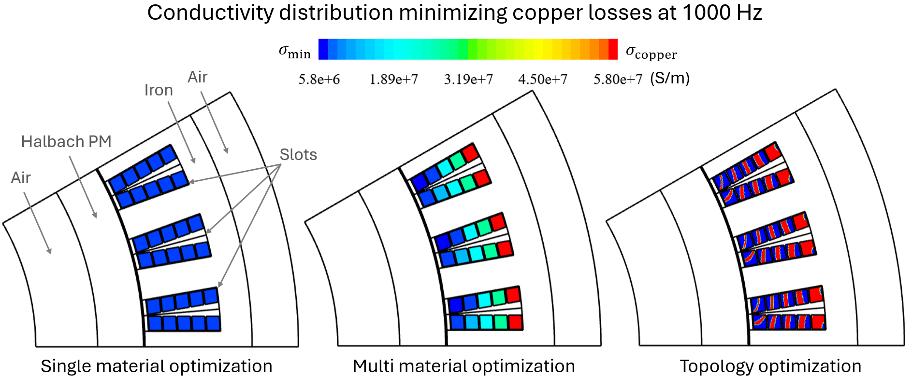

# Topopt-AC-losses

[](https://github.com/tcherrie/topopt-AC-losses) [](https://github.com/tcherrie/topopt-AC-losses/releases/) [](https://github.com/tcherrie/topopt-AC-losses/stargazers)

Parametric and topology optimization of armature conductors' in electrical machines to minimize AC losses.



## 1) Quickstart

First, download the repo and follow the installation instruction in Section 2. 
Then, go to the [index](0_index.ipynb) and run the Jupyter Notebooks.

## 2) Installation
Install the required packages in a new Python environment (version 3.13 or later, see `requirements.txt`)

For installing the packages, open a terminal, create and activate a dedicated Python environment, using for instance `conda` (requires the installation of [miniconda](https://www.anaconda.com/docs/getting-started/miniconda/main) ): 

`conda create -n myenv python=3.13`

with `myenv` being replaced by your environment name, and activate it:

`conda activate myenv`

Then, go to the folder where the code is located:

`cd C:\path\to\the\folder`

replacing `C:\path\to\the\folder` by the path to the local folder containing this code. The, install the required packages using 

`pip install -r requirements.txt`

After that, you should be able to run the scripts on your computer.

### Run the scripts
Execute one of the notebooks in your favorite IDE within your newly created `myenv` environment, starting for instance from [0_index](0_index.ipynb).

## 3) Papers using this repository

> Cherrière T., Pons A., Krebs G., Mercier A., Benmamas L. & Küttler S.  (2026)
> ***Reducing AC losses in Halbach electrical machines with density topology optimization of winding***  
> *International Conference on Electrical Machines (ICEM 2026), Madeiras, September 2026*
> paper DOI: *to be published*
> Code version:  [](https://doi.org/10.5281/zenodo.20457486)


## 4) Contents of the repository

```
.
├── utils/  # Utilities and helper
│   ├── geometry.py       # geometry and mesh generation
│   ├── optimization.py   # derivative computation & optimization algorithms
│   ├── physics.py        # physical solver and post-processing
│   ├── supply.py         # defines the current feeding
│
├── scenes/  # Stored figures obtained from the notebooks
│   ├── optim/      # optimization results
│   ├── ref/        # reference computations (copper conductors)
│
| # Scripts to execute
├── 0_index.ipynb
├── 1_reference_simulation.ipynb
├── 2_taylor_tests.ipynb
├── 3_single_material_optimization.ipynb
├── 4_multi_material_optimization.ipynb
├── 5_topology_optimization.ipynb
│
| # Installation and instructions
├── requirements.txt # numpy, matplotlib, ngsolve, scipy
├── README.md
|
| # Metadata
├── AUTHORS # T. Cherrière, A. Pons, G. Krebs, A. Mercier, L. Benmamas, S. Küttler
└── LICENSE # GNU LGPL 2.1 or any later version
```

## 5) License

Copyright (C) Théodore CHERRIERE (theodore.cherriere@centralesupelec.fr), Alexis PONS (alexis.pons@centralesupelec.fr), Guillaume KREBS (guillaume.krebs@centralesupelec.fr), Adrien MERCIER (adrien.mercier@centralesupelec.fr), Loucif BENMAMAS (loucif.benmamas@safrangroup.com), Sulivan KÜTTLER (sulivan.kuttler@safrangroup.com)


This code is free software: you can redistribute it and/or modify it under the terms of the GNU Lesser General Public License as published by the Free Software Foundation, either version 3 of the License, or (at your option) any later version.

This code is distributed in the hope that it will be useful, but WITHOUT ANY WARRANTY; without even the implied warranty of MERCHANTABILITY or FITNESS FOR A PARTICULAR PURPOSE. See the GNU Lesser General Public License for more details.

You should have received a copy of the GNU Lesser General Public License and of the GNU General Public License along with this code. If not, see <http://www.gnu.org/licenses/>. Please read their terms carefully and use this copy of the code only if you accept them.
